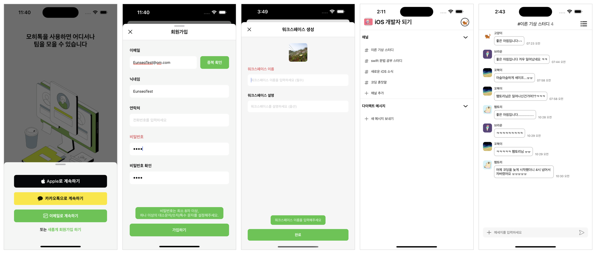

## Mojitalk - 언제 어디서나 팀과 소통하기



## 앱 소개
 * 카카오 및 애플 소셜로그인을 통한 간편한 회원가입 및 로그인 지원
 * 워크스페이스를 생성하여 팀원들과의 소통 공간 생성 및 채널을 통한 채팅방 분리
 * 채널 채팅을 통한 팀원들과의 실시간 소통 지원
<br/>

## 주요 기능
 * Moya 라이브러리를 활용하여 Router Pattern으로 추상화한 네트워크 로직으로 채팅 등을 위한 서버 통신
 * Alamofire에 내장된 Interceptor 기능을 활용한 서버 토큰 갱신 로직 구현
 * RxSwift 및 RxDataSources 라이브러리로 작성한 반응형 프로그래밍 코드로 각종 유효성 검사 및 테이블뷰 갱신
 * Realm 라이브러리에 채팅 내용 저장하여 네트워크가 연결되지 않은 환경에서도 지난 채팅 내용 표현
 <br/>

## 개발 기간
 * 2024.01.10. ~ 2024.02.29.
<br/>


## 개발환경
  * Xcode 15.2
  * Supported Destinations : iPhone
  * Minimum Deployments : 16.0
  * Orientation : Portrait
<br/>


## 사용기술 및 라이브러리
 * UIKit, Snapkit, RxSwift, RxDataSources
 * Moya, KakaoOpenSDK, Realm, IQKeyboardManagerSwift
 * MVVM, Repository Pattern, Router Pattern
 <br/>
 
## 트러블 슈팅     
 ### 1. 반복되는 토큰 갱신 로직 모듈화
   * 사용자가 로그인을 했을 때 access 토큰의 만료에 따른 네트워크 요청 로직이 반복되어 Interceptor를 구현하여 모듈화
   * 상태코드 200에 응답 데이터로 에러 코드가 전달되어 다음과 같은 코드로 데이터에 접근하여 그에 따른 네트워크 요청 여부 등의 추가 동작 수행

     ```swift
     func retry(_ request: Request, for session: Session, dueTo error: Error, completion: @escaping (RetryResult) -> Void) {
   
       guard let request = request as? DataRequest, let data = request.data, let result = try? JSONDecoder().decode(ErrorResponse.self, from: data) else {
          completion(.doNotRetry)
          return
       }
        
      if result.errorCode == "E05" {
           AuthNetworkManager.shared.request()
           completion(.retry)
       }
      ...
     }
     ```
   
 ### 2. Custom View 내부 객체에 대한 터치 이벤트 등의 상호작용 이슈
   * 반복되는 형태의 view가 많아 custom view를 만들어 별도 관리하였으나 해당 뷰에 속한 객체들에 대해 터치 이벤트 등의 상호작용이 되지 않는 이슈 발생
   * subView를 가지는 UIView의 높이를 지정하지 않아 발생한 이슈로 `debug view hierarchy`를 활용하여 디버깅
   * 다음과 같이 custom view의 전체 높이를 지정하여 이슈 해결
     ```swift
      name.snp.makeConstraints { make in
         make.top.equalTo(profileImage.snp.bottom).offset(16)
         make.horizontalEdges.equalToSuperview().inset(24)
         make.height.equalTo(76)
      }
     ```

<br/>

## 회고
 * 서버와의 네트워크 통신에서 크고 작은 이슈가 많이 발생하였는데 이러한 이슈 대응 경험이 후에 많은 도움이 될 것이라고 여겨짐
 * 주어진 기획안의 내용 뿐만 아니라 사용자의 편의성을 고려하느라 사소한 부분에 신경을 많이 써 보다 많은 기능을 구현하지 못해 아쉬움이 남음
 * Xcode 15 업데이트 후 에셋 관리를 하지 않아도 UIImage 및 UIColor로 불러올 수 있게 되어 코드로 정리하지 않았으나,
   일부 기능을 사용할 때에는 해당 기능을 사용하기 어려워 정리하는 것이 낫다고 판단되어 다음 개발 시 반영하기로 다짐함
